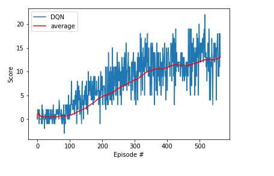

# Report
---
This project utilised the architecture for solving the Banana Navigation Problem using DQNs.

## State and Action Space
The simulation contains a single agent that navigates a large environment.  At each time step, it has four actions at its disposal:
- `0` - walk forward 
- `1` - walk backward
- `2` - turn left
- `3` - turn right

The state space has `37` dimensions and contains the agent's velocity, along with ray-based perception of objects around agent's forward direction.  


## Learning algorithm

The agent training utilised the `dqn` function in the navigation notebook. 

It continues episodical training via a dqn agent until `n_episodes` is reached or until the environment is solved. The environment is considered solved when the average reward (over the last 100 episodes) is at least +13.

Each episode continues until `max_t` time-steps is reached or until the environment says it's done.

A reward of `+1` is provided for collecting a yellow banana, and a reward of `-1` is provided for collecting a blue banana. 

The dqn agent is contained in `agent.py`.

For each time step the dqn_state acts on the current state and epsilon-greedy values. The dqn_agent utilise a replay buffer of experiences.

### DQN Hyper Parameters  

- n_episodes (int): maximum number of training epi5sodes
- max_t (int): maximum number of timesteps per episode
- eps_start (float): starting value of epsilon, for epsilon-greedy action selection
- eps_end (float): minimum value of epsilon
- eps_decay (float): multiplicative factor (per episode) for decreasing epsilon

Where
`n_episodes=1000`, `max_t=10000`, `eps_start=0.5`, `eps_end=0.01` and`eps_decay=0.98`

The epsilon-greedy values were found via trial and error after noticing that initial random actions could often lead to positive average rewards for early episodes.

There seemed no reason to have low number of episodes or timesteps, so reasonable high numbers were chosen.

### DQN Agent Hyper Parameters

- BUFFER_SIZE (int): replay buffer size
- BATCH_SIZ (int): mini batch size
- GAMMA (float): discount factor
- TAU (float): for soft update of target parameters
- LR (float): learning rate for optimizer
- UPDATE_EVERY (int): how often to update the network

Where 
`BUFFER_SIZE = int(1e6)`, `BATCH_SIZE = 128`, `GAMMA = 0.99`, `TAU = 1e-3`, `LR = 0.0001` and `UPDATE_EVERY = 2`  

The computer running this had 48 GB of ram, so buffer size and batch size was increased. GAMMA and TAU stayed at the default values. With Learning rate and update every updated by trial and error.

### Neural Network
The model utilises 2 x 64 Fully Connected Layers with Relu activation followed by a final Fully Connected layer with the same number of units as the action size. The network has an initial dimension the same as the state size.   

## Plot of Rewards



```
Episode 100	Average Score: 0.76
Episode 200	Average Score: 4.74
Episode 300	Average Score: 8.19
Episode 400	Average Score: 10.78
Episode 500	Average Score: 12.10
Episode 564	Average Score: 13.01
Environment solved in 564 episodes! Average Score: 13.01
```

## Ideas for Future Work

The initial random generation of actions would often generate relatively high average scores. Time was spent twiddling the epsilon-greedy values manually over multiple runs. Thus with some refactoring of the current code, this process could be optimised to find the best settings in an automated fashion.

Running the trained model without using some randomness ie setting the eps value would lead to the agent getting stuck in a repeating pattern. Thus there is potential to tweak replay memory in learning to remove these patterns and/or implementing it to generate random actions when not in training mode when in a repeated pattern, if the environment is not done.


