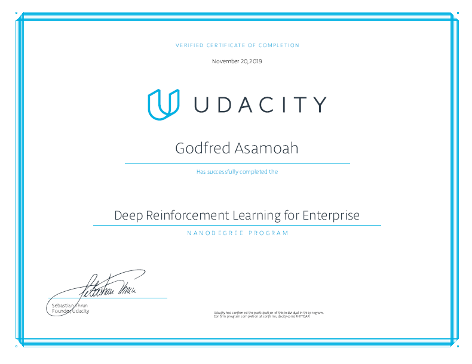

# Reinforcement Learning Nanodegree Projects

This repository contains my solution materials and notebooks for Udacity's [Reinforcement Learning Nanodegree Program](https://www.udacity.com/course/deep-reinforcement-learning-nanodegree--nd893) projects.

## Projects

- [1 - Navigation](/1-navigation): Train an agent to navigate a virtual world and collect as many yellow bananas as possible while avoiding blue bananas.

- [2 - Continuous Control](/2-continuous-control): Train a double-jointed robotic arm to reach target locations.

- [3 - Collaboration & Competition](/3-collaboration-competition): Train a pair of agents to play tennis.

## Graduation Certificate🎉🎉

[Certificate Link](https://confirm.udacity.com/JHETQAR)
